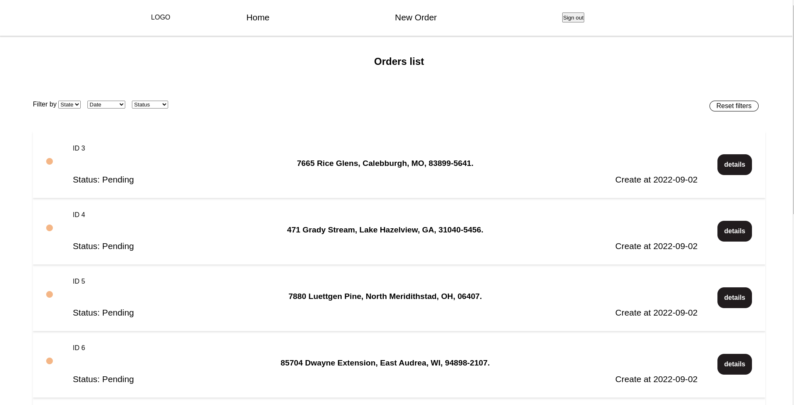
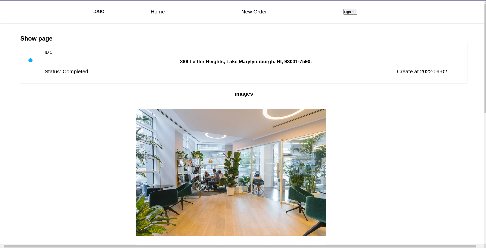
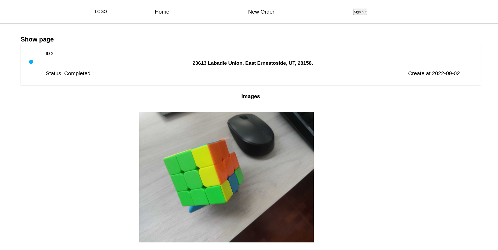
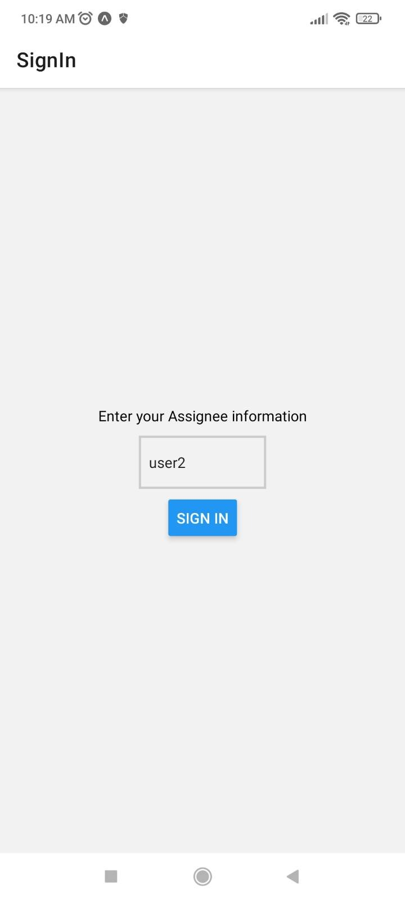
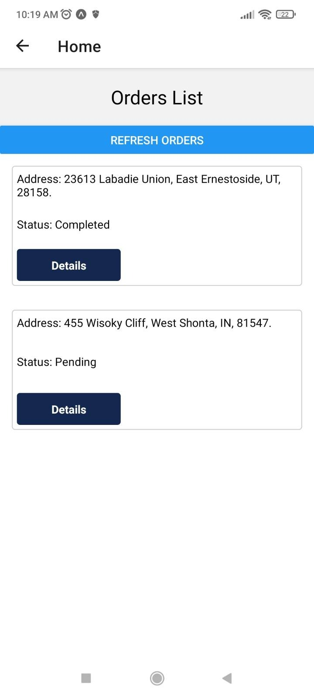
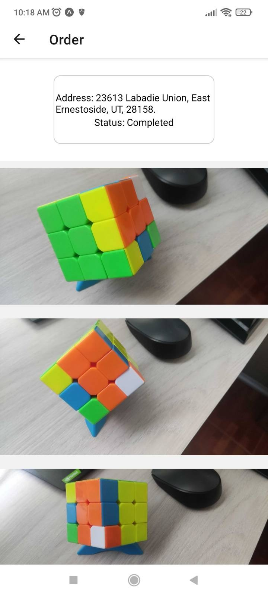

# ProxyPics

> This is a full stack project with a REST API, web app, and mobile app in which the manager`Requester` can assign `Orders` to users `Assignees`.

## Requirements 

- Ruby on Rails v 7. x. For more information on how to install Ruby on Rails, please follow this [link](https://guides.rubyonrails.org/getting_started.html)

- Make sure you have PostgreSQL installed on your machine. [This tutorial](https://www.digitalocean.com/community/tutorials/how-to-install-and-use-postgresql-on-ubuntu-18-04) is an example of how to set it up on Ubuntu.

- Node.js v 16 or greater. More information [here](https://nodejs.org/en/)

- Yarn. More information [here](https://www.npmjs.com/package/yarn) 

## Web App

> 
> 
> 

Before running the server first add a `.env`:

```
cp web-app/.env.example web-app/.env
```

To set up the `web-app` run the following command on the terminal:

```
# install all dependencies for web-app
yarn web:dependencies

# create and seed database
yarn db:setup

# launch rails server and compile react
web:server
```

For debugging you can run `yarn dev` and `rails s` on different terminal windows to debug the app.

### Users

The database seed will create the initial users necessary to interact with the app.

For the web-app use `admin`
For the `mobile-app`, it is available `user1`, `user2`, and `user3`

# Mobile App

> 
> 
> 


Before running the expo server first add a `.env`:

```
cp mobile-app/helpers/constants.example.js mobile-app/helpers/constants.js
```

To run the server:

```
# install dependencies for mobile-app
cd mobile-app/ && yarn install

# yarn start
```

To open the app on your phone it'll be necessary to install the expo app:
- [Android](https://play.google.com/store/apps/details?id=host.exp.exponent&referrer=www)
- [IOS](https://apps.apple.com/app/apple-store/id982107779)

and scan the QR code shown on the terminal

## Authors

👤 **Gustavo Carvalho**

- GitHub: [@gscarv13](https://github.com/gscarv13)
- LinkedIn: [Gustavo Carvalho](https://www.linkedin.com/in/gscarv13)
